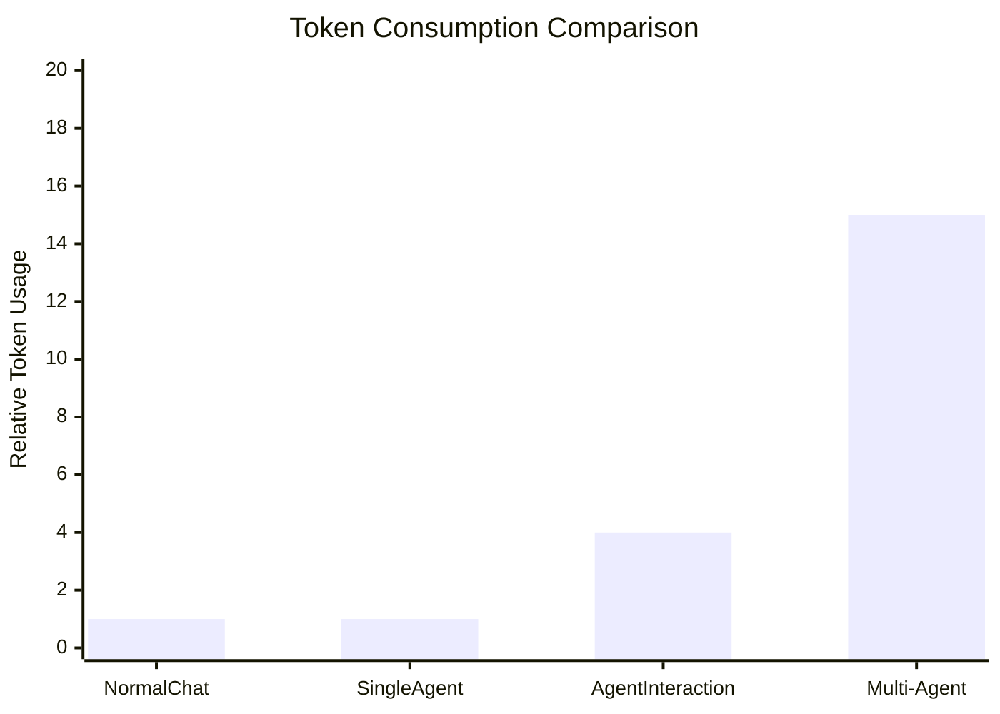

# Mermaid 图表存档

当内容类型为 Mermaid 图表时，按本规范处理。通用存档流程（vault 路径、文件名、确认）见 `../SKILL.md`。

## Workflow

1. **获取图表内容** — 从对话中提取 Mermaid 代码
2. **生成文件名** — 基于主题生成 `{taskname}.md`
3. **构建内容** — 使用标准 Obsidian 格式
4. **写入文件** — 路径：`<vault 路径>/{taskname}.md`，使用 Write 工具

## 常见错误与修复

### xychart-beta 不支持中文标签

**错误：**

```
Lexical error on line 3. Unrecognized text.
x-axis [普通聊天, 单智能体, ...]
```

**修复：** 使用英文标签，在代码块下方用文字说明中文含义



**数据说明：**

- Normal Chat = 普通聊天
- Single Agent = 单智能体
- ...

### annotation 语法不支持

**错误：** xychart-beta 不支持 `annotation` 语句（Obsidian Mermaid 插件不支持）

**修复：** 移除 annotation，在代码块外用文字说明数据点
